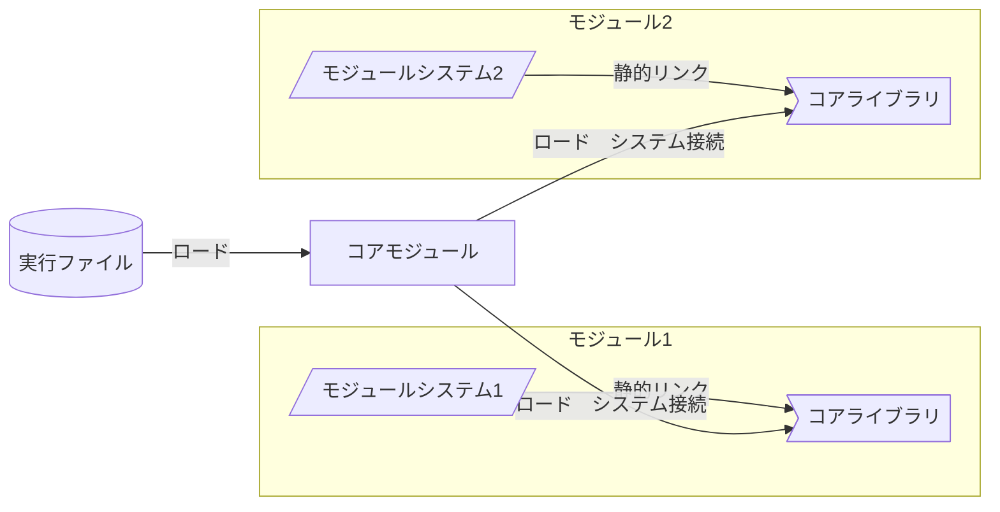

# LeyEngine Core
LeyEngineのコア機能を提供するモジュール、及び、インタフェースです。  

ファイル構成は以下の通りです。
```txt
[Core]
 ├ [Build]
 │  ├ [Debug]
 │  ├ [Library]
 │  │  ├ [Windows] x64構成のみ
 │  │  │  ├ [Other] Core以外のモジュール用ビルド結果
 │  │  │  └ [Core] Coreモジュール用ビルド結果
 │  │  :
 │  └ [Module]
 │     ├ [Windows] x64構成のみ
 │     :
 ├ [include]
 │  ├ [XXX.h]
 │  :
 └ [src]
    ├ [XXX.cpp]
    :
```

# Library
コアライブラリを構成するプロジェクトです。  
コアライブラリはすべてのモジュールに静的リンクされます。  
コアモジュールが提供するシステムのインタフェースを提供します。  
|ビルド対象|ファイル|
|:--------|:-------|
|Windows  |Core.lib|
|macOS    |Core.a  |
|Android  |Core.a  |
|iOS      |Core.a  |

# Module
コアモジュールを構成するプロジェクトです。  
コアモジュールは実行ファイルから動的ロードされ、すべてのモジュールを動的ロードします。  
コアモジュールは、各モジュールにリンクされたコアライブラリに各システムのアドレスを渡すことで、モジュール間で統一されたシステムの提供を保証します。  


コアモジュールもコアライブラリの機能を使用するため、ビルド時はコアモジュール用にビルドしたコアライブラリを静的リンクする必要があります。
|ビルド対象|ファイル|
|:--------|:-------|
|Windows  |Core.dll|
|macOS    |Core.so |
|Android  |Core.so |
|iOS      |Core.so |

# ビルド
LEYENGINE_CORE_MODULEシンボルでライブラリとモジュールの仕様を分けます。